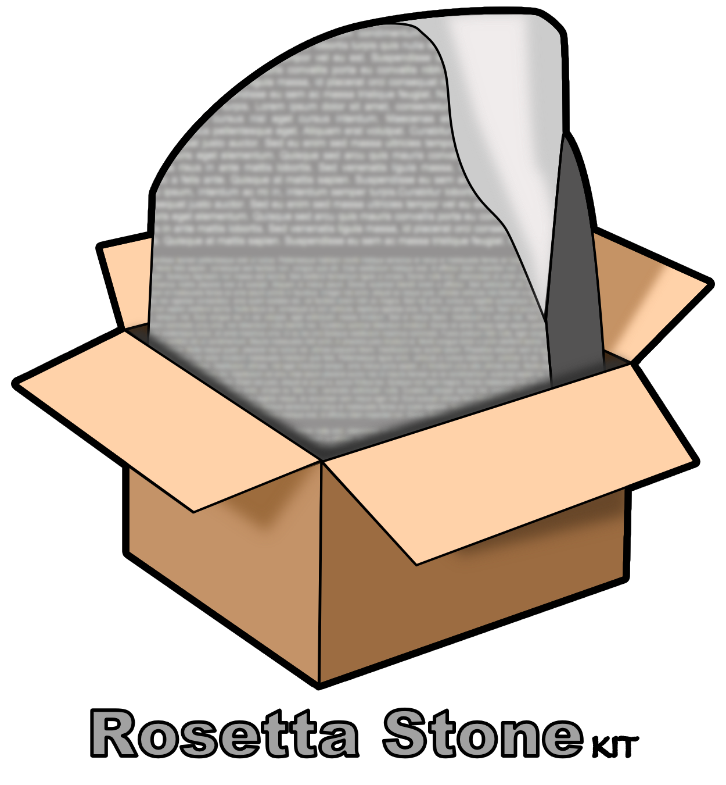

RosettaStoneKit is a magical Object Mapping framework. It converts dictionaries
and arrays of data into instances of any classes. It can also convert your
custom objects into dictionaries and arrays.

[](https://travis-ci.org/endoze/RosettaStoneKit)

## Motivation

There are other frameworks available that provide the same functionality, but
they all made design decisions that limit their usefulness. This framework
does not require that you subclass some special class that adds in all of the
magic for you. It doesn't require a category on NSObject that pollutes every
object with additional methods. And finally, the intent is to do one thing and
do it very well. This framework doesn't include networking code or any other
features.

## Show me the code

```objective-c
// User.h

@interface User

@property (nonatomic, copy) NSString *firstName;
@property (nonatomic, strong) NSNumber *userId;
@property (nonatomic, strong) NSDate *birthday;
@property (nonatomic, strong) NSString *lastName;

@end
```

```objective-c
// Elsewhere

NSDictionary *userDictionary = @{
  @"firstName": @"Joe",
  @"userId": 42,
  @"birthday": @"1970-01-01T00:00:00.000Z",
  @"lastName": @"User"
};

RosettaStone *stone = [RosettaStone sharedInstance];

User *joeUser = [stone translate:userDictionary toClass:[User class]];
```

### When things aren’t so perfect

```objective-c
// Team.h

@interface Team

@property (nonatomic, copy) NSString *name;
@property (nonatomic, strong) NSNumber *teamNumber;
@property (nonatomic, strong) NSArray *games;

@end
```

```objective-c
// Elsewhere

NSDictionary *teamDictionary = @{
  @"name": @"Piggers",
  @"number": 42,
  @"games": @[
    @{ @"name": @"Table Hocky championships"},
    @{ @"name": @"Ping Pong championships"}
  ]
};

RosettaStone *stone = [RosettaStone sharedInstance];

PropertyTranslator *numberTranslator = [propertyTranslatorForClass:[Team class] fromKey:@"number" toProperty:@"teamNumber"];
PropertyTranslator *gamesTranslator = [propertyTranslatorForClass:[Team class] fromArrayKey:@"games" toArrayProperty:@"games" withClass:[Game class]];

[stone registerPropertyTranslator:numberTranslator];
[stone registerPropertyTranslator:gamesTranslator];

Team *piggers = [stone translate:teamDictionary toClass:[Team class]];
```

### When you really need to change stuff

```objective-c
// Game.h

typedef enum : NSUInteger {
  PingPongGameType,
  FoosballGameType,
  TableHockeyGameType,
  NoGameType,
} GameType;

@interface Game

@property (nonatomic, copy) NSString *name;
@property (nonatomic) GameType type;

@end
```

```objective-c
// Elsewhere

NSDictionary *gameDictionary = @{
  @"name": @"FoosBall Championships",
  @"type": 2
};

RosettaStone *stone = [RosettaStone sharedInstance];
PropertyTranslator *gameTypeTranslator = [propertyTranslatorForClass:[Game class]
                                                             fromKey:@"type" toProperty:@"type"
                                               withInterpolatorBlock:^id(id propertyValue) {
  NSUInteger number = [(NSNumber *)propertyValue unsignedIntegerValue];

  switch (number) {
    case 1:
      return PingPongGameType;
    case 2:
      return FoosballGameType;
    case 3:
      return TableHockeyGameType;
    default:
      return NoGameType;
  }
}];
[stone registerPropertyTranslator:gameTypeTranslator];

Game *foosballChampionshipGame = [stone translate:gameDictionary toClass:[Game class]];
```

### Converting your objects into dictionaries

```objective-c
// User.h

@interface User

@property (nonatomic, copy) NSString *firstName;
@property (nonatomic, strong) NSNumber *userId;
@property (nonatomic, strong) NSDate *birthday;
@property (nonatomic, strong) NSString *lastName;

@end
```

```objective-c
// Elsewhere

User *joeUser = [User new];
joeUser.firstName = @"Joe";
joeUser.userId = @2;
joeUser.lastName = @"User";

RosettaStone *stone = [RosettaStone sharedInstance];

NSDictionary *joeUserDictionary = [stone translateToDictionary:joeUser];
```
